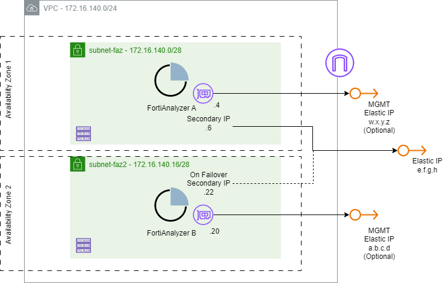
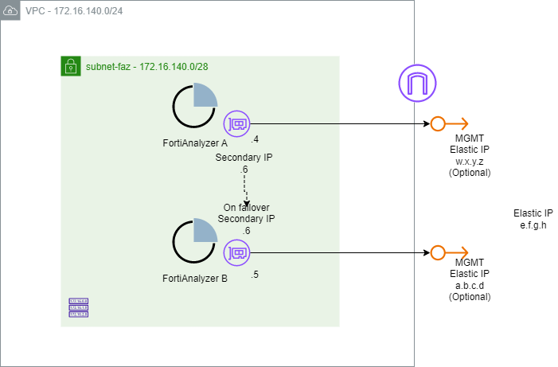
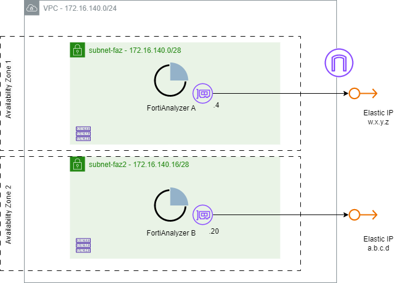

# AWS FortiAnalyzer HA Terraform Module

:wave: - [Introduction](#introduction) - [Architecture & Design](#architecture--design) - [HA Modes Configurations](#ha-modes-configurations) - [Terraform Deployment](#terraform-deployment) - [Troubleshooting](#troubleshooting) - :wave:

## Introduction

This repository contains Terraform modules for deploying Fortinet FortiAnalyzer on AWS in a High Availability (HA) cluster. FortiAnalyzer provides centralized log collection, analytics, reporting, and incident management for Fortinet devices. The module automates the compute, networking, IAM, and security-group resources required for a two-node FortiAnalyzer cluster, supporting both active-passive and active-active operation.

## Architecture & Design

The module deploys two FortiAnalyzer EC2 instances and wires them into an HA cluster. Cluster role, virtual IP behavior, and subnet placement all depend on the chosen HA mode.

The module supports three topologies, selected by `ha_mode` (`a-p` or `a-a`) and, for active-passive, `ha_ip` (`public` or `private`):

1. **Active-Passive with Public VIP** 

FortiAnalyzer A and FortiAnalyzer B land in different subnets / AZs — cross-AZ resilience. Each node gets its own management EIP, plus a public VIP that fronts the cluster.
Once the HA cluster is successfully formed, FazUtil creates a secondary private IP address on eni1 interface of both FortiAnalyzers instances and assigns the public VIP to the primary FortiAnalyzer. During a failover , the public VIP is automatically reassigned to the new primary FortiAnalyzer, ensuring continuous management access.
FortiAnalyzer uses its instance IAM role to reassociate the public VIP to the new primary node.
Only the HA primary can receive logs and archive files from its directly connected device and forward them to HA secondary.



2. **Active-Passive with Private VIP** 

Both nodes sit in the same subnet / AZ. By default, no public IP addresses are assigned to the FortiAnalyzer instances. If direct management access from the internet is required, you can optionally assign public IP addresses to the management interfaces of the FortiAnalyzer nodes. FortiAnalyzer A's ENI carries two private IPs: a primary address and the secondary private VIP HA address. Failover moves this secondary private IP between nodes.



3. **Geo-Redundant Active-Active**

FortiAnalyzer A and FortiAnalyzer B land in different subnets / AZs. Each node gets its own EIP; there is no VIP. Both nodes are active and can receive logs and archive files from its directly connected device and forward logs and archive files to its HA peer.



**Deployed Components**

| Component | Resource | Notes |
|-----------|----------|-------|
| Compute | `aws_instance.faz1`, `aws_instance.faz2` | `m5.xlarge` by default; encrypted gp2 100 GB root volume each |
| Log storage | `aws_ebs_volume.faz{1,2}_logs` | Optional, encrypted gp3 500 GB volume per node, mounted as `/dev/sdf` |
| Networking | `aws_network_interface.faz{1,2}` | One ENI per node; `faz1` ENI holds the floating private VIP in active-passive private mode |
| Public addressing | `aws_eip.faz1`, `aws_eip.faz2`, `aws_eip.vip` | `faz1`/`faz2` EIPs in a-a and a-p public; `vip` EIP only in a-p public |
| Access control | `aws_security_group.fortianalyzer` | Ingress for management, logging, and HA (see below) |
| Permissions | `aws_iam_role` / `aws_iam_instance_profile` | Optional (off by default); grants IP/EIP-move permissions for failover |
| AMI | `data.aws_ami.fortianalyzer_{byol,payg}` | Latest Marketplace AMI for the chosen license type/version |

**Security group ingress**

The cluster heartbeat/election runs over VRRP (IP protocol 112) and data sync over TCP 5199 between the two nodes. The module includes a broad "all traffic from the VPC CIDR" rule, which is what currently permits VRRP and 5199 between peers — see [Limitations](#limitations) for tightening this.

| Port / Protocol | Source | Purpose |
|-----------------|--------|---------|
| TCP 22 | `admin_cidr` | SSH access |
| TCP 443 | `admin_cidr` | HTTPS management UI |
| TCP 541 | `fortigate_cidr` | FGFM — secure device/log transmission |
| UDP 514 | `fortigate_cidr` | Syslog reception |
| TCP 5199 | `0.0.0.0/0` | FortiAnalyzer HA synchronization |
| All (protocol -1) | VPC CIDR | Intra-VPC traffic — covers VRRP (112) heartbeat and 5199 sync between peers |

**IAM Permissions**

Set `create_iam_role = true` so FortiAnalyzer can move the VIP/secondary IP during failover.

```json
{
  "Version": "2012-10-17",
  "Statement": [
    {
      "Effect": "Allow",
      "Action": [
        "ec2:AssignPrivateIpAddresses",
        "ec2:DescribeSubnets",
        "ec2:DescribeNetworkInterfaces",
        "ec2:DescribeAddresses",
        "ec2:AssociateAddress",
        "ec2:CreateTags",
        "s3:GetObject"
      ],
      "Resource": "*"
    }
  ]
}
```

## HA Modes Configurations

1. **VRRP Automatic Failover with Public VIP**

**FortiAnalyzer A**
<pre><code>
config system ha
    set mode a-p
    set group-id 1
    set group-name FAZHA
    set hb-interface port1
    <b>set initial-sync enable</b>
    set hb-interval 5
    set hb-lost-threshold 10
    set password <b>ha_password</b>
    set priority 100
    set preferred-role primary
    config peer
        edit 1
            set addr <b>FortiAnalyzer B Private IP address</b>
            set serial-number <b>FortiAnalyzer B serial number</b>
        next
    end
    config vip
        edit 1
            set vip <b>FortiAnalyzer HA Public IP address</b>
            set vip-interface port1
        next
    end
end
</code></pre>

**FortiAnalyzer B**

<pre><code>
config system ha
    set mode a-p
    set group-id 1
    set group-name FAZHA
    set hb-interface port1
    set hb-interval 5
    set hb-lost-threshold 10
    set password <b>ha_password</b>
    set priority 1
    set preferred-role secondary
    config peer
        edit 1
            set addr <b>FortiAnalyzer A Private IP address</b>
            set serial-number <b>FortiAnalyzer A serial number</b>
        next
    end
    config vip
        edit 1
            set vip <b>FortiAnalyzer HA Public IP address</b>
            set vip-interface port1
        next
    end
end
</code></pre>


2. **Active-Passive with Private VIP** 

**FortiAnalyzer A**

<pre><code>
config system ha
    set mode a-p
    set group-id 1
    set group-name FAZHA
    set hb-interface port1
    <b>set initial-sync enable</b>
    set hb-interval 5
    set hb-lost-threshold 10
    set password <b>ha_password</b>
    set priority 100
    set preferred-role primary
    config peer
        edit 1
            set addr <b>FortiAnalyzer B Private IP address</b>
            set serial-number <b>FortiAnalyzer B serial number</b>
        next
    end
    config vip
        edit 1
            set vip <b>FortiAnalyzer HA Private IP address</b>
            set vip-interface port1
        next
    end
end
</code></pre>
**FortiAnalyzer B**

<pre><code>
config system ha
    set mode a-p
    set group-id 1
    set group-name FAZHA
    set hb-interface port1
    set hb-interval 5
    set hb-lost-threshold 10
    set password <b>ha_password</b>
    set priority 1
    set preferred-role secondary
    config peer
        edit 1
            set addr <b>FortiAnalyzer A Private IP address</b>
            set serial-number <b>FortiAnalyzer A serial number</b>
        next
    end
    config vip
        edit 1
            set vip <b>FortiAnalyzer HA Private IP address</b>
            set vip-interface port1
        next
    end
end
</code></pre>

3. **Geo-Redundant Active-Active**

**FortiAnalyzer A**
<pre><code>
config system ha
    set mode a-a
    set group-id 1
    set group-name FAZHA
    set hb-interface port1
    <b>set initial-sync enable</b>
    set hb-interval 5
    set hb-lost-threshold 10
    set password <b>ha_password</b>
    set priority 100
    set preferred-role primary
    config peer
        edit 1
            set addr <b>FortiAnalyzer B Private IP address</b>
            set serial-number <b>FortiAnalyzer B serial number</b>
        next
    end
end
</code></pre>

**FortiAnalyzer B**

<pre><code>
config system ha
    set mode a-a
    set group-id 1
    set group-name FAZHA
    set hb-interface port1
    set hb-interval 5
    set hb-lost-threshold 10
    set password <b>ha_password</b>
    set priority 1
    set preferred-role secondary
    config peer
        edit 1
            set addr <b>FortiAnalyzer A Private IP address</b>
            set serial-number <b>FortiAnalyzer A serial number</b>
        next
    end
end
</code></pre>

## Terraform Deployment

### Prerequisites and Requirements

- AWS CLI configured with appropriate permissions
- Terraform >= 1.0 and AWS provider >= 5.0
- An existing VPC and the required subnets/AZs (see `subnet_ids` rules)
- AWS key pair for SSH access (optional)
- For BYOL: valid FortiAnalyzer license files or FortiFlex tokens, plus the appliance serial numbers
- [FortiAnalyzer supported instances](https://docs.fortinet.com/document/fortianalyzer-public-cloud/8.0.0/aws-administration-guide/369910/instance-type-support)
- [FortiAnalyzer requires a minimum disk size of 500 GB](https://docs.fortinet.com/document/fortianalyzer-public-cloud/8.0.0/aws-administration-guide/571011/deploying-fortianalyzer-vm-using-manual-launch )
- During deployment the aws certificate "AmazonRootCA1" added for both FortiAnalyzers. This certificate can also be downloaded from this [link](https://www.amazontrust.com/repository/)

### Features

- **Three HA topologies**: active-passive with a public VIP, active-passive with a private VIP, or active-active — selected with `ha_mode` and `ha_ip`
- **Automated AMI Discovery**: Automatically finds the latest FortiAnalyzer AMI based on license type (BYOL/PAYG) and version
- **Flexible Licensing**: Support for both BYOL (Bring Your Own License) and PAYG (Pay As You Go) deployments
- **Security**: Pre-configured security group with rules for management, log collection, and HA sync
- **Storage**: Configurable, encrypted root and log volumes per node
- **IAM Integration**: Optional IAM role granting the IP/EIP-move permissions needed for failover

### Module Structure

```
terraform-aws-fortianalyzer/
├── modules/
│   ├── ha/                       # HA FortiAnalyzer deployment module
├── examples/
│   ├── ha/                       # HA example deployment
│   │   ├── main.tf
│   │   ├── variables.tf
│   │   ├── terraform.tfvars.example
│   │   ├── outputs.tf
└── README.md
```
### Recommendations

1. **Restrict Management Access**: Set `admin_cidr` to specific ranges and narrow the SSH rule from `0.0.0.0/0`.
2. **Enable the IAM Role**: Use `create_iam_role = true` for active-passive failover.
3. **Use Private Subnets**: Deploy in private subnets with a VPC endpoint for the EC2 API where possible.
4. **Enable Encryption**: Root and log volumes are encrypted by default — keep it that way.
5. **Regular Updates**: Keep the FortiAnalyzer version updated

### Instructions

- Copy all Terraform configuration files into your working directory. Then, rename the file terraform.tfvars.example to terraform.tfvars. 
The terraform.tfvars file contains all configurable input variables for the deployment. 

- Set the variables from terraform.tfvars file

- Run the following commands:

```bash
terraform init
terraform plan
terraform apply
```
- You can delete the integration and remove all created resources using the following command:

```bash
terraform destroy
```
## Outputs

The module provides comprehensive outputs including:
- Instance information (ID, IPs, state)
- Network details (security groups, interfaces)
- Management URLs and SSH connection strings
- Storage and IAM resource information

## Troubleshooting

Run the following commands in the FortiAnalyzer CLI:

- shows the FortiAnalyzer HA configuration and current cluster details.
```
faz1 # get system ha
local-cert          : (null)
mode                : a-p 
aws-access-key-id   : (null)
aws-secret-access-key: *
cfg-sync-hb-interval: 4
group-id            : 1
group-name          : FAZHA 
hb-interface        : port1 
hb-interval         : 5
healthcheck         : 
initial-sync        : enable 
initial-sync-threads: 4
load-balance        : round-robin 
log-sync            : enable 
password            : *
peer:
    == [ 1 ]
    id: 1           
preferred-role      : primary 
priority            : 100
unicast             : enable 
vip:
    == [ 1 ]
    id: 1   
```

- Displays the current FortiAnalyzer HA cluster state, including which node is primary/secondary, peer connectivity, and synchronization status.
```
faz1 # diagnose ha status
HA-Status: Primary (active)
     up-time: 1h17m39.332s
 config-sync: Allow
   serial-no: FAZ-VMTMxxxx
      fazuid: 1229478609
    hostname: faz1

HA-Secondary FAZHA@172.16.137.235 FAZ-VMTMxxxx
          ip: 172.16.137.235
   serial-no: FAZ-VMTMxxxx
      fazuid: 2233171479
    hostname: faz2
     conn-st: up
up/down-time: 1h17m38.981s
    conn-msg: 
  cfgsync-st: up, 1h16m57.308s
data-init-sync-st: done, 1h17m18.320s
```

- Displays detailed HA performance and synchronization statistics in FortiAnalyzer, such as log sync counters, packet/transfer statistics, heartbeat status, and cluster sync health.
```
faz1 # diagnose ha stats 
keepalived data:
keepalived data:
   State = MASTER
   Last transition = 1781855860.342000 (Fri Jun 19 00:57:40.342000 2026)
keepalived data:
keepalived data:
   Status = GOOD
   State = idle
keepalived data:
   State = UP, RUNNING, no broadcast, loopback, no multicast
   State = UP, RUNNING

keepalived stats:
  Advertisements:
    Received: 14
    Sent: 546
  Became master: 1
  Released master: 0
  Packet Errors:
    Length: 0
    TTL: 0
    Invalid Type: 0
    Advertisement Interval: 0
    Address List: 0
  Authentication Errors:
    Invalid Type: 0
    Type Mismatch: 0
    Failure: 0
  Priority Zero:
    Received: 0
    Sent: 0

Notifications from keepalived 4 times
 last one at 2026, Jun 19 00:57:42 (143), transit from Secondary to Primary

Notifications to logfwd 6 times
 last one at 2026, Jun 19 01:26:28 (1869), forwarding to FAZHA@172.16.137.235
===== HA Statistics =====

cluster status: up

--- cluster member information ---

ip                              : 172.16.137.235
serial number                   : FAZ-VMTMxxxxxxx
hostname                        : faz2
role                            : secondary
status                          : up
pending sync'ed data(bytes)     : 0
secondary down alert            : off
secondary re-join alert         : off
last error                      : n/a
```

- Check the traffic between HA peers
```
diagnose sniffer packet <ha-interface> 'host <peer-ip>' 4
```

- Enable HA debug output (run on both nodes before/while forming the cluster to surface errors):

```
diagnose debug application ha 255
```

- Force a manual HA failover in a FortiAnalyzer HA cluster, making the current secondary unit take over as primary.

```
 diag ha failover
```

Force a configuration re-sync if logs synced but configuration did not:

```
diagnose ha force-cfg-resync
```

Common issues:
- **Cluster never forms** — do not enable initial sync on both nodes at once. Enable `initial-sync` on the primary only; stop sync on the secondary (or reboot it), then sync from the primary.
- **VIP does not move on failover** — confirm `create_iam_role = true` and that the instances can reach the AWS EC2 API (internet or a VPC endpoint).
- **Peers cannot reach each other** — check security group inbound rules to verify allowed traffic between nodes.
- **After deployment, cluster may not be formed until retype ha password**

You can find additional HA commands in the [FortiAnalyzer CLI reference](https://docs.fortinet.com/document/fortianalyzer/8.0.0/cli-reference/118618/ha).

## Support

For issues and questions:
1. Check the [examples](../../examples/) for common use cases
2. Review Fortinet documentation for FortiAnalyzer
3. Open an issue in this repository

## References

- [FortiAnalyzer AWS Administration Guide](https://docs.fortinet.com/document/fortianalyzer-public-cloud/8.0.0/aws-administration-guide/)
- [Setting up a FortiAnalyzer HA cluster](https://docs.fortinet.com/document/fortianalyzer-public-cloud/8.0.0/aws-administration-guide/215911/configuring-fortianalyzer-ha)
- [FortiAnalyzer HA Configuration and Troubleshooting (Fortinet Community)](https://community.fortinet.com/t5/FortiAnalyzer/Technical-Tip-FortiAnalyzer-HA-Configuration-and-Troubleshooting/ta-p/219808)
- [Terraform AWS Provider Documentation](https://registry.terraform.io/providers/hashicorp/aws/latest/docs)
